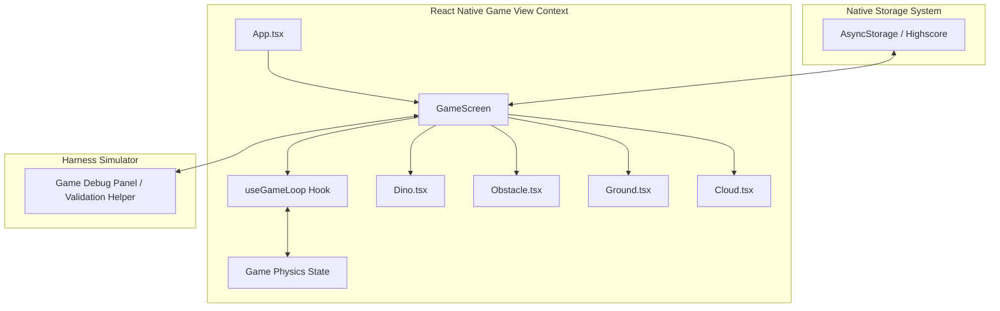

# React Native Chrome Dino Game - Harness Engineering (Native)

이 디렉토리는 React Native 기반 크로스 플랫폼 환경에서 Chrome 공룡 게임(Chrome Dino Game)을 실행, 테스트 및 고도화하기 위한 **하네스 엔지니어링(Harness Engineering) 문서 체계**입니다. 

기존의 WebView 내부 HTML5 Canvas 게임 구동 구조를 걷어내고, **React Native 네이티브 컴포넌트(View, Text, Animated 등)와 순수 JavaScript 게임 루프 엔진으로 전면 전환**하여 저지연(Low Latency) 모바일 입력 반응성과 고효율 하드웨어 가속을 실현합니다.

---

## 1. 하네스 엔지니어링(Harness Engineering)이란?

본 프로젝트에서 정의하는 하네스 엔지니어링은 **"WebView를 배제한 순수 React Native 환경에서 각 게임 요소(공룡, 장애물, 지면)의 입력·상태·물리를 독립 컴포넌트 단위로 모니터링 및 제어하고 최적화 성능을 검증하는 테스트 소프트웨어 환경 구축"**을 의미합니다.

주요 엔지니어링 대상은 다음과 같습니다:
- **성능 하네스 (Performance Harness):** React Native의 JS 스레드와 UI 스레드 간 렌더링 프레임(FPS) 측정 및 기기 자원 소모(CPU/Memory) 최적화.
- **물리 검증 하네스 (Physics Harness):** 중력 물리 공식($g=0.6$) 및 AABB Inner Collision Box 판정이 사양대로 동작하는지 검증.
- **입력 반응성 시뮬레이터 (Input Latency Simulator):** 네이티브 터치 제스처(`onTouchStart`, `onTouchMove`) 동작 감지 시점과 물리 연산 적용 시점 간 저지연(30ms 이하) 달성률 측정.

---

## 2. 문서 구조 (Directory Structure)

문서는 하네스 엔지니어링의 생명 주기에 따라 다음과 같이 구분됩니다:

```text
harness-study/
├── .agents/
│   └── AGENTS.md                          # 에이전트 개발 및 정적 분석(Lint/Test) 강제 규칙
└── docs/harness-engineering/
    ├── README.md                          # [본 문서] 전체 문서 개요 및 가이드맵
    ├── design.md                          # Google Material Design 3 기반 UI 규격 가이드라인
    ├── requirements/
    │   └── game_specifications.md        # 게임 물리 엔진 공식, 조작성 명세 및 요구사항
    ├── architecture/
    │   ├── system_architecture.md        # 네이티브 컴포넌트, 통합 게임 루프 및 자원 최적화
    │   └── agent_collaboration.md        # 기획·개발·평가 에이전트 상호 평가 프로토콜
    ├── development_harness/
    │   ├── test_environment.md           # 에뮬레이터 설정, 가상 디바이스 제어 및 디버거 연동
    │   └── bridge_simulation.md          # 네이티브 게임 상태 시뮬레이션 및 데이터 정합성 검사
    └── testing/
        └── test_scenarios.md             # 시나리오 기반 수동/자동화 테스트 케이스
```

---

## 3. 핵심 아키텍처 개요

Chrome 공룡 게임은 각 물리 계산 상태를 계산하는 `useGameLoop` Hook과 각 요소를 네이티브 절대 좌표 및 픽셀 아트로 그리는 개별 컴포넌트들로 결합됩니다.



---

## 4. 문서 이용 방법

1. **에이전트 지침 확인:** [AGENTS.md](file:///Users/sun925/Desktop/Git/harness-study/.agents/AGENTS.md)를 통해 에이전트가 코드를 완성한 후 강제해야 하는 `npx lint` 및 `npx test` 작업 규칙과 컴포넌트 마크다운 기술 규칙을 숙지합니다.
2. **에이전트 협업 체계 파악:** [architecture/agent_collaboration.md](file:///Users/sun925/Desktop/Git/harness-study/docs/harness-engineering/architecture/agent_collaboration.md)에서 기획/개발/평가 에이전트가 어떤 라이프사이클로 상호 평가하는지 점검합니다.
3. **디자인 규격 일관성 확보:** [design.md](file:///Users/sun925/Desktop/Git/harness-study/docs/harness-engineering/design.md)에서 Google Material Design 3 기반으로 정의된 컴포넌트 크기, 마이크로 인터랙션 및 대비 비율을 확인합니다.
4. **요구사항 파악:** [requirements/game_specifications.md](file:///Users/sun925/Desktop/Git/harness-study/docs/harness-engineering/requirements/game_specifications.md)에서 게임의 기본 동작 원리와 터치 트리거를 확인합니다.
5. **시스템 인터페이스 이해:** [architecture/system_architecture.md](file:///Users/sun925/Desktop/Git/harness-study/docs/harness-engineering/architecture/system_architecture.md)에서 React Native 단독 구동 및 물리 루프 아키텍처 사상을 공부합니다.
6. **테스트 환경 설정:** [development_harness/test_environment.md](file:///Users/sun925/Desktop/Git/harness-study/docs/harness-engineering/development_harness/test_environment.md)에 기술된 가이드에 따라 개발용 에뮬레이터와 디버깅 툴을 연동합니다.
7. **시뮬레이션 수행:** [development_harness/bridge_simulation.md](file:///Users/sun925/Desktop/Git/harness-study/docs/harness-engineering/development_harness/bridge_simulation.md)를 바탕으로 게임 내 상태 유효성을 시뮬레이션합니다.
8. **검증 가이드라인 준수:** [testing/test_scenarios.md](file:///Users/sun925/Desktop/Git/harness-study/docs/harness-engineering/testing/test_scenarios.md)의 테스트 케이스를 모두 통과하는지 확인하며 릴리즈를 준비합니다.
