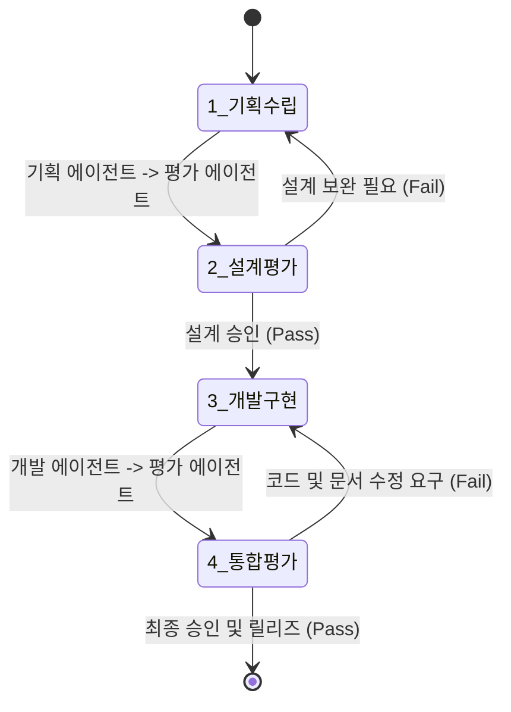

# 멀티 에이전트 협업 및 상호 평가 프로토콜 설계서

이 문서는 Harness Engineering을 수행할 때 단일 에이전트가 처리하지 않고, **기획(Planning) 에이전트**, **개발(Development) 에이전트**, **평가(Evaluation) 에이전트**로 역할을 격리하여 상호 유기적으로 평가하고 피드백 루프를 도는 협업 구조를 상세히 기술합니다.

---

## 1. 멀티 에이전트의 역할 및 정의

협업 시스템은 다음 세 가지 특화형 에이전트로 구성됩니다:

```text
+-----------------------+       요구사항 검토       +-----------------------+
|  1. 기획 에이전트       |  ======================>  |  3. 평가 에이전트       |
|  (Planning Agent)     |  <======================  |  (Evaluation Agent)   |
+-----------------------+       피드백 & 평가        +-----------------------+
           ||                                                   ▲
           || 기획 통과 시 구현 지시                              │
           \/                                                   │
+-----------------------+        코드 및 문서 검증                │
|  2. 개발 에이전트       |  ===================================┘
|  (Development Agent)  |
+-----------------------+
```

### 1.1 기획 에이전트 (Planning Agent)
- **주요 임무:** 사용자 요구사항 해석, 시스템 및 컴포넌트 인터페이스 설계서(`implementation_plan.md`) 작성, 에지 케이스(Edge Case) 발굴.
- **산출물:** 요구사항 정의서, 기능 명세서, 시퀀스 다이어그램.

### 1.2 개발 에이전트 (Development Agent)
- **주요 임무:** 기획 에이전트의 설계안을 바탕으로 실제 소스 코드(App.tsx, 컴포넌트, 서비스 등) 구현 및 컴포넌트 내부 기술 명세서 작성.
- **산출물:** `.tsx`, `.ts`, `.js` 코드 파일, 컴포넌트별 내장 마크다운 문서.

### 1.3 평가 에이전트 (Evaluation Agent)
- **주요 임무:** 설계안의 무결성 검증, 개발 에이전트가 작성한 코드의 린트/테스트 성공 여부 판정, 시뮬레이터 실행을 통한 성능 평가 및 검증 리포트 작성.
- **산출물:** 테스트 스크립트 실행 로그, 린트 오류 분석 결과, 상호 평가 통과 여부 성적표(Evaluation Report).

---

## 2. 상호 평가 및 협업 파이프라인 (Execution Pipeline)

성공적인 설계 및 구현 결과물 도출을 위해 아래 4단계의 게이트웨이 파이프라인을 운영합니다.



### 2.1 [Gate 1] 설계 검증 단계 (Plan Review)
- 기획 에이전트가 요구사항 명세 및 설계안을 작성하면, 평가 에이전트가 이를 분석하여 **"요구사항 누락 여부"**, **"모바일 환경에서의 오프라인 실현 가능성"**, **"Bridge 통신의 직렬화 충돌 가능성"**을 평점(A~F)과 피드백으로 기획 에이전트에게 리턴합니다.
- C등급 이하를 받을 시 기획 에이전트는 기획안을 전면 재작성해야 합니다.

### 2.2 [Gate 2] 구현 및 정적 검증 단계 (Static Code Review)
- 개발 에이전트가 코드를 작성한 후, 평가 에이전트는 `.agents/AGENTS.md` 지침에 따라 아래 명령을 대리로 수행하여 정적 분석을 진행합니다:
  ```bash
  npm run lint && npm run test
  ```
- 린팅 위반이나 테스트 케이스 실패 시 빌드 차단(Build Block)을 수행하며 개발 에이전트에게 재개발을 요구합니다.

### 2.3 [Gate 3] 컴포넌트 정보 파일 검증 (Documentation Check)
- 평가 에이전트는 신규 생성되거나 수정된 컴포넌트 내부 경로를 횡단하여, `.md` 명세 문서가 정확하게 삽입/삭제되었는지 검사합니다.
- 컴포넌트 내부 정보 문서가 없거나 부실한 경우 평가 에이전트는 불합격 처리를 진행합니다.

---

## 3. 상호 평가 기준표 (Evaluation Metrics Matrix)

평가 에이전트가 설계 및 코드를 평가하는 세부 기준은 다음과 같습니다.

| 평가 항목 | 대상 에이전트 | 중요도 | 세부 평가 기준 |
| :--- | :--- | :--- | :--- |
| **요구사항 부합성** | 기획 | High | Chrome 공룡 게임의 점프/중력 및 터치 컨트롤 스펙이 모두 설계에 누락 없이 반영되었는가? |
| **디자인 일관성** | 기획/개발 | Medium | Google Material Design 가이드라인을 따르는 컴포넌트 스펙을 유지하는가? |
| **코드 안정성** | 개발 | High | 린트(Lint) 에러가 전혀 없고, 단위 테스트 및 통합 테스트를 100% 통과하는가? |
| **문서 무결성** | 개발 | Medium | 신규 컴포넌트에 대한 기술 마크다운 문서가 약속된 포맷으로 폴더 내에 정확히 위치하는가? |
| **인터페이스 호환성**| 기획/개발 | High | Native와 WebView의 Bridge 통신 프로토콜 데이터의 유효성 검증 로직이 포함되었는가? |
