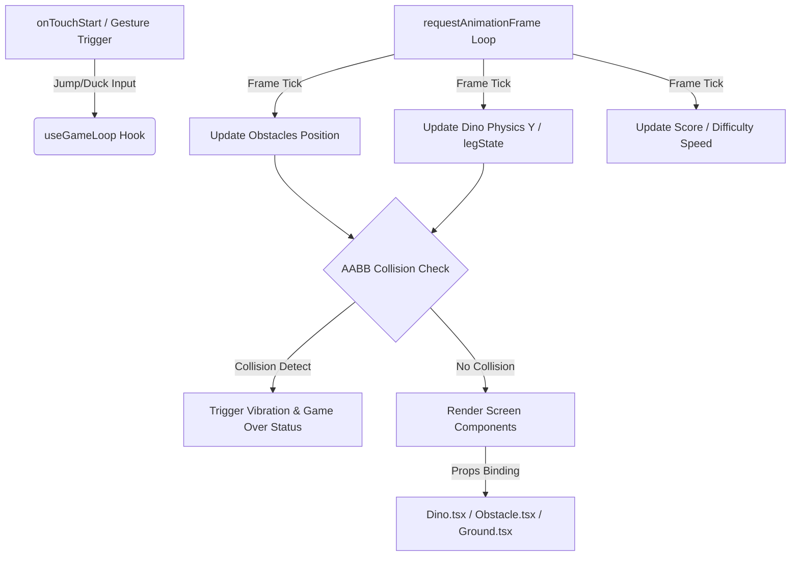

# 시스템 아키텍처 설계서 (Native)

이 문서는 Webview를 배제하고 React Native 네이티브 영역(Native Realm)에서 각 게임 요소들을 컴포넌트로 완전히 분리한 단독 구동형 게임 시스템의 상세 설계서입니다. 컴포넌트 간의 결합성 제어, 렌더링 파이프라인, 입력 제어 및 고성능 갱신 설계를 정의합니다.

---

## 1. 전체 아키텍처 레이어

모바일 환경에서의 최고 수준의 렌더링 반응성(저지연)과 독립적 검증(Testing Harness)이 가능하도록 관심사 분리(Separation of Concerns) 원칙을 적용하였습니다.

```text
+---------------------------------------------------------------+
| 1. React Native Application Container (Native UI Layer)       |
|    - App.tsx, GameScreen.tsx                                  |
|    - App State, AsyncStorage (Highscore), Gesture Detection   |
+---------------------------------------------------------------+
                               || (State Binding / Callbacks)
                               \/
+---------------------------------------------------------------+
| 2. Unified Game Loop Hook (Engine Layer)                      |
|    - useGameLoop.ts                                           |
|    - requestAnimationFrame Loop                               |
|    - Physics Update, Collision Detector, Spawner & Scorer     |
+---------------------------------------------------------------+
                               || (Props / Absolute Rendering)
                               \/
+---------------------------------------------------------------+
| 3. Chrome Dino Game Component Array (Native Drawing Layer)    |
|    - Dino.tsx, Obstacle.tsx, Ground.tsx, Cloud.tsx            |
|    - M3 Typography, Vibration Haptic Feedback, Pixel Art Views|
+---------------------------------------------------------------+
```

---

## 2. 네이티브 렌더링 및 해상도 최적화 전략

모바일 네이티브 화면에 최적화된 그래픽 표현과 레이아웃 배치 전략입니다.

### 2.1 뷰포트 비율 스케일링 (Viewport Ratio Scaling)
- **표준 해상도:** 게임 내부 엔진은 가로 `600px`, 세로 `200px` 규격을 가상의 좌표 공간(Virtual Coord Space)으로 설정하여 구동됩니다.
- **스케일 비율(Scale Factor) 동적 계산:**
  - 화면 컨테이너 너비(`containerWidth`)에 맞춰 스케일 팩터 $S = \frac{\text{containerWidth}}{600}$를 동적 도출합니다.
  - 게임 내의 모든 좌표(공룡 $Y$, 장애물 $X$ 등)와 컴포넌트의 크기(width, height)는 이 스케일 팩터 $S$를 곱하여 최종 픽셀 좌표 및 크기로 변환되어 렌더링됩니다.
  - 이를 통해 해상도가 다른 다양한 안드로이드 및 iOS 디바이스 환경에서 비주얼이 깨지지 않고 동일한 구도와 비율을 균일하게 보장합니다.

### 2.2 픽셀 아트 컴포넌트 분리 (Pixel Art Views)
- 이미지 에셋을 외부 파일로 불러오는 대신, React Native의 절대 좌표(`<View style={{ position: 'absolute' }}>`)들을 조합하여 픽셀 스타일의 스프라이트 그래픽을 구현합니다.
- HTML Canvas에서 그리던 T-Rex, Cactus, Pterodactyl의 세부 형상 사각형 배열을 컴포넌트 내부에 내장하여 렌더링을 처리함으로써, 별도의 이미지 로딩 지연이 없고 높은 디스플레이 밀도(PPI)에서도 매우 깔끔한 픽셀 선명도를 유지합니다.

---

## 3. unified Game Loop 및 상태 관리 흐름

게임 구동 상태의 변경 흐름은 전적으로 `useGameLoop` Hook 내에서 `requestAnimationFrame`을 통해 통제됩니다.



### 3.1 렌더링 부하 최소화
- React의 상태값(`useState`)을 매 프레임(16.6ms)마다 무차별적으로 업데이트하면 가상 DOM 연산 부하가 증가할 수 있습니다.
- 따라서 빈번한 프레임 틱 연산(좌표, 윙 상태 등)은 React Native가 즉각 리렌더링하도록 훅 내부에서 상태 묶음으로 제어하고, 가볍고 얕은 속성(Props)만을 최하위 렌더링 컴포넌트로 바인딩합니다.
- 복잡한 렌더링 오버헤드를 막기 위해 스크롤 및 위치 연산은 스케일된 크기의 `left`, `top` 값으로 컴포넌트에 주입됩니다.

---

## 4. 모듈 인터페이스 규격 (Component Interface Specification)

### 4.1 `useGameLoop` Output Props
- **`score`**: `number` (실시간 누적 점수)
- **`gameStatus`**: `'IDLE' | 'PLAYING' | 'GAMEOVER'`
- **`dinoY`**: `number` (공룡의 가상 Y 좌표)
- **`isDucking`**: `boolean` (숙이기 상태 여부)
- **`legState`**: `number` (뛰기 애니메이션 발 상태, 0 또는 1)
- **`obstacles`**: `Array<ObstacleData>` (현재 활성화된 장애물 배열)
- **`resetGame`**: `() => void` (게임 초기화 함수)
- **`triggerJump`**: `() => void` (점프 지시 함수)
- **`setDucking`**: `(ducking: boolean) => void` (숙이기 제어 함수)

### 4.2 `Dino` Component Props
- **`y`**: `number` (스케일 적용 전 가상 Y 좌표)
- **`isDucking`**: `boolean`
- **`legState`**: `number`
- **`isJumping`**: `boolean`
- **`scale`**: `number` (스케일 팩터)
- **`groundY`**: `number` (스케일 적용 전 가상 지면 Y 좌표)

### 4.3 `Obstacle` Component Props
- **`type`**: `'CACTUS' | 'BIRD'`
- **`x`**: `number` (가상 X 좌표)
- **`y`**: `number` (가상 Y 좌표)
- **`width`**: `number` (가상 넓이)
- **`height`**: `number` (가상 높이)
- **`wingState`**: `number`
- **`scale`**: `number`

---

## 5. 장애 대응 및 안정성 보장 설계 (Fault Tolerance)

1. **프레임 유실 감지 및 델타 시간 보정:**
   - 렌더링 루프 실행 시 프레임 드롭(FPS 저하)이 발생할 경우, 물리 연산 속도가 급격히 느려지거나 장애물을 뚫고 지나가는 문제가 발생할 수 있습니다.
   - 프레임 계산 시 델타 시간(Delta Time - 이전 프레임과의 시간 간격)을 계산하여 프레임당 이동 픽셀을 보정(Time-based Physics)함으로써 프레임 레이트가 변해도 공룡과 장애물의 이동 속도 일관성을 유지합니다.
2. **배경 스크롤 순환 정합성 검증:**
   - 무한 횡스크롤 처리 시 누적 연산으로 인해 지면의 좌표 값이 무한히 마이너스로 가면서 부동 소수점 에러가 발생할 수 있습니다.
   - 지면 점(dot) 스크롤 좌표가 화면 폭 크기를 벗어날 때마다 모듈러 연산(`% canvasWidth`)을 사용하여 한정된 메모리 내부에서 위치 좌표를 안전하게 순환시킵니다.
