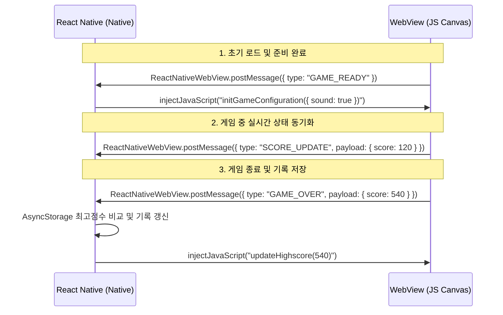

# 시스템 아키텍처 및 통신 브릿지 설계서

이 문서는 React Native(Native Realm)와 WebView(Web Realm)로 분리된 하이브리드 어플리케이션 아키텍처의 상세 설계서입니다. 두 영역 간의 책임 격리, 통신 프로토콜 규격 및 데이터 흐름을 정의합니다.

---

## 1. 전체 아키텍처 레이어

모바일 환경에서의 안정적인 구동과 독립적 검증(Testing Harness)이 가능하도록 관심사 분리(Separation of Concerns) 원칙을 적용하였습니다.

```text
+-------------------------------------------------------------+
| 1. React Native Application Container (Native Layer)         |
|    - App.tsx, GameScreen.tsx                                |
|    - App State, AsyncStorage (Highscore), Gesture Detection |
+-------------------------------------------------------------+
                              ||  (Native Bridge)
                              \/
+-------------------------------------------------------------+
| 2. Hybrid Communication Bridge (Interface Layer)            |
|    - WebView API (injectJavaScript, onMessage)             |
|    - Message Serialization / Deserialization & Dispatcher   |
+-------------------------------------------------------------+
                              ||  (Web Context)
                              \/
+-------------------------------------------------------------+
| 3. Chrome Dino Game Engine (Web Canvas Layer)               |
|    - index.html, dino.js, main.css                          |
|    - Canvas Renderer, Sprite Animator, Game Physics Engine  |
+-------------------------------------------------------------+
```

---

## 2. WebView 통합 및 최적화 전략

모바일 네이티브 화면처럼 느껴지게 하기 위해 웹뷰 컴포넌트에 특화된 스타일링 및 네이티브 하드웨어 가속 설정이 필수적입니다.

### 2.1 Viewport 및 스케일 제어
웹뷰 내부 HTML 소스의 메타 태그를 모바일 뷰포트에 맞게 강제 잠금 처리하여 불필요한 확대/축소 및 더블 탭 제스처 간섭을 원천 차단합니다.
```html
<meta name="viewport" content="width=device-width, initial-scale=1.0, maximum-scale=1.0, user-scalable=no, viewport-fit=cover" />
```

### 2.2 로컬 에셋(Local Asset) 및 오프라인 구동
- **구현 방식:** 외부 웹 호스트 서버에 연결하지 않고, 웹 리소스(HTML, CSS, JS, Sprite Image, Audio)를 React Native 앱의 번들(Android: `android/app/src/main/assets`, iOS: Xcode App Bundle) 내부 로컬 경로에 포함시켜 구동합니다.
- **성능 이점:** 네트워크 지연 시간이 0ms가 되며 비행기 모드에서도 완벽히 구동됩니다.

---

## 3. React Native - WebView 양방향 통신 Bridge 설계

두 실행 컨텍스트 간 데이터 교환은 비동기 메시지 패싱(Asynchronous Message Passing) 메커니즘을 사용합니다.



### 3.1 Web -> Native (ReactNativeWebView.postMessage)
웹뷰 컨텍스트 내에서 네이티브로 데이터(예: 점수, 게임 종료 상태)를 보낼 때 사용합니다.
- **JS 코드:**
  ```javascript
  const sendMessage = (type, payload) => {
    if (window.ReactNativeWebView) {
      window.ReactNativeWebView.postMessage(JSON.stringify({ type, payload }));
    }
  };
  ```

### 3.2 Native -> Web (injectJavaScript)
네이티브 컨텍스트에서 웹뷰의 글로벌 함수를 직접 호출하거나 전역 설정을 변경할 때 사용합니다.
- **TypeScript 코드:**
  ```typescript
  const sendToWebView = (action: string, data: any) => {
    const jsCode = `window.dispatchEvent(new CustomEvent('${action}', { detail: ${JSON.stringify(data)} })); true;`;
    webViewRef.current?.injectJavaScript(jsCode);
  };
  ```

---

## 4. 메시지 프로토콜 규격 (Message Interface Specification)

하네스 검증 시 주고받는 JSON 스키마는 아래 명세를 엄격히 지켜야 합니다.

### 4.1 WebView -> React Native 메시지

1. **게임 준비 완료 알림 (`GAME_READY`)**
   - **설명:** 웹뷰 내부의 DOM 및 게임 에셋 로드가 완료되어 입력 대기 상태임을 네이티브에 보고.
   - **구조:** `{ "type": "GAME_READY" }`

2. **실시간 점수 보고 (`SCORE_UPDATE`)**
   - **설명:** 점수가 100점 단위로 증가할 때마다 네이티브에 최신 스코어 전달.
   - **구조:**
     ```json
     {
       "type": "SCORE_UPDATE",
       "payload": {
         "score": 200
       }
     }
     ```

3. **게임 오버 (`GAME_OVER`)**
   - **설명:** 장애물 충돌 시 게임 오버 상태를 보고하고 최종 점수 전송.
   - **구조:**
     ```json
     {
       "type": "GAME_OVER",
       "payload": {
         "score": 870,
         "playTimeSeconds": 45
       }
     }
     ```

### 4.2 React Native -> WebView 메시지

1. **설정 동기화 (`SYNC_SETTINGS`)**
   - **설명:** 네이티브 환경설정(사운드 온/오프, 조작 난이도 변경 등)을 웹뷰에 주입.
   - **구조:**
     ```json
     {
       "action": "SYNC_SETTINGS",
       "data": {
         "soundEnabled": true,
         "vibrationEnabled": false
       }
     }
     ```

2. **최고 기록 업데이트 (`UPDATE_HIGHSCORE`)**
   - **설명:** 디바이스 내에 보관된 유저의 영구 최고 기록을 웹뷰에 갱신하여 화면 상단에 렌더링하도록 지시.
   - **구조:**
     ```json
     {
       "action": "UPDATE_HIGHSCORE",
       "data": {
         "highscore": 1420
       }
     }
     ```

---

## 5. 장애 대응 및 안정성 보장 설계 (Fault Tolerance)

1. **웹뷰 비정상 종료 (Webview Crash) 감지:**
   - React Native WebView의 `onRenderProcessGone` 프로프를 활용하여 웹뷰 렌더링 엔진 메모리 누수나 크래시를 감지하고, 유저에게 "게임 재시도" UI를 Native 단에서 긴급 팝업으로 노출하고 웹뷰를 강제 갱신(Reload)합니다.
2. **양방향 통신 실패 예외 처리:**
   - 만약 `postMessage` 전달 중 직렬화 오류가 발생할 경우를 감안하여 웹뷰 내부에서 `try-catch` 블록으로 래핑하고, 실패 로그를 웹 내부 `console.error`로 내보내 테스트 하네스 감지 시스템에 기록합니다.
